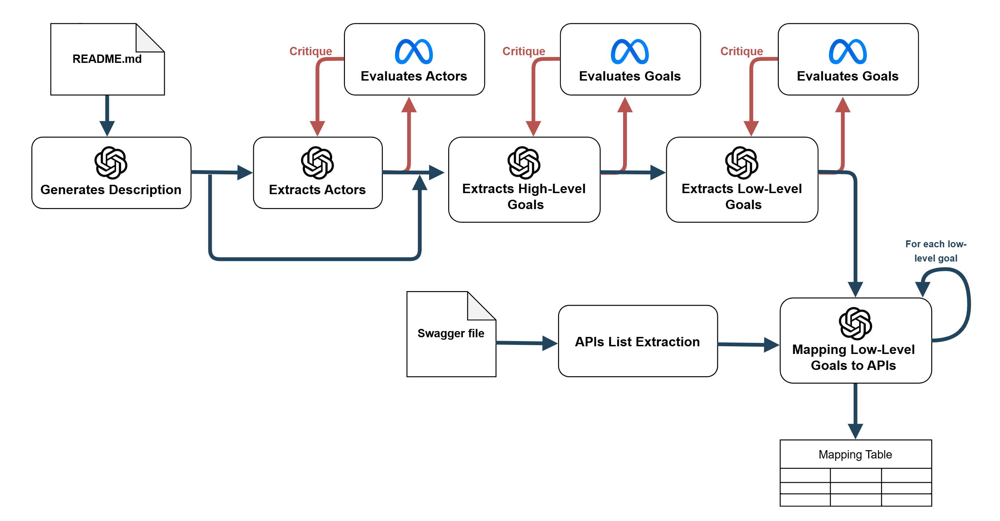

# LLM Multi-Agent Chain for Goal Oriented API Alignement

## Overview

This repository presents a system that automates the alignment of high-level goals with API endpoints using Goal-Oriented Requirements Engineering (GORE) principles and Large Language Models (LLMs). The system extracts goals from natural language requirement documents, decomposes them into structured objectives, and maps them to corresponding API endpoints. This approach enhances the automation of software requirement analysis by translating system goals into actionable API calls.

## Architecture: LLM Multi-Agent Chain



Our framework integrates multiple LLM agents working in a Chain to iteratively extract, refine, and validate goals before mapping them to API functionalities. The key components of this system include:

- 📄 **Documentation Processing:** Converts unstructured natural language requirement documents (e.g., README files, requirement specifications) into structured descriptions.
- 🎯 **Goal Extraction:** Identifies high-level strategic goals based on stakeholder needs.
- 🔍 **Goal Decomposition:** Breaks down high-level goals into detailed, low-level technical objectives.
- 🔗 **API Mapping:** Aligns the extracted low-level goals with existing API endpoints using available API documentation (e.g., Swagger files).
- 🔄 **Iterative Validation:** Employs a feedback loop where LLM-generated outputs are evaluated and refined based on quality thresholds.

## Installation

### Prerequisites

Ensure you have Python installed along with the necessary dependencies.

### Steps

1. **Clone this repository:**
   ```bash
   git clone https://github.com/dadoluca/LLM_MultiAgentChain_GoalOrientedAPIAlignement.git
   cd LLM_MultiAgentChain_GoalOrientedAPIAlignement
   ```
2. **Install required dependencies:**
   ```bash
   pip install -r requirements.txt
   ```
3. **Run the notebook experiments.ipynb in notebook folder**

## Research Questions

This project aims to explore the following research questions:

- RQ1: What is the effectiveness of LLM agents in modeling high-level goals?
- RQ2: What is the effectiveness of LLM agents in decomposing high-level goals to low-level goals?
- RQ3: What is the effectiveness of LLM agents in mapping low-level goals to API endpoints?

## Case Study: Genome Nexus

Genome Nexus is an open-source project that aggregates, annotates, and standardizes genomic variant data. Our system applies automated goal decomposition to align its objectives with available API functionalities. The structured goal mapping facilitates efficient API interactions, reducing manual effort in requirement-to-API translation.

## License

This project is licensed under the **GNU GPL Version 3 License**. See the [LICENSE](LICENSE) file for details.

## Contact 📬 

**Authors:**  
- 🧑‍💻 [Luca Dadone](https://github.com/dadoluca) 
- 🧑‍💻 [Andrea Bioddo](https://github.com/andreabioddo) 
- 🧑‍💻 [Angelo Bongiorno](https://github.com/AngeloBongiorno) 

For any inquiries, please reach out to the authors.  


